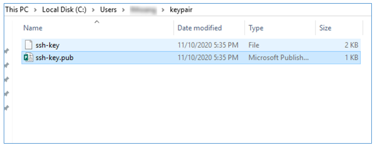
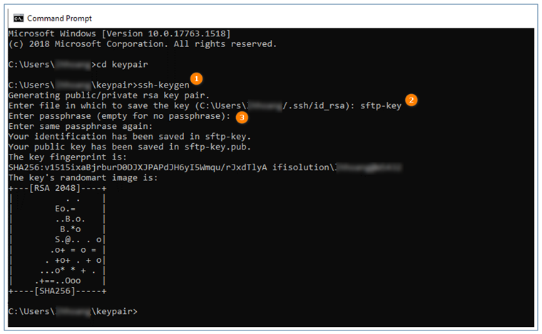
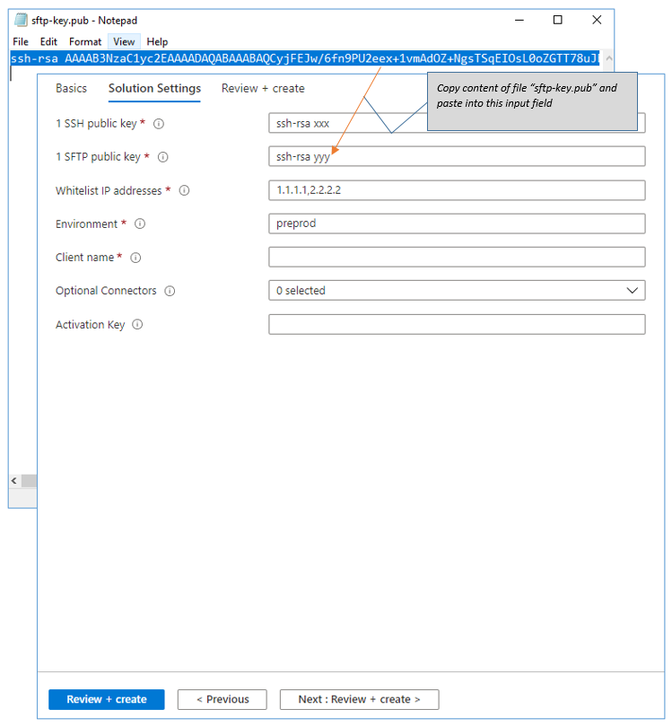
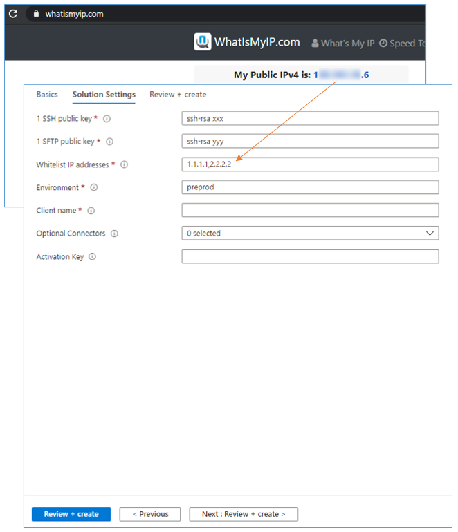
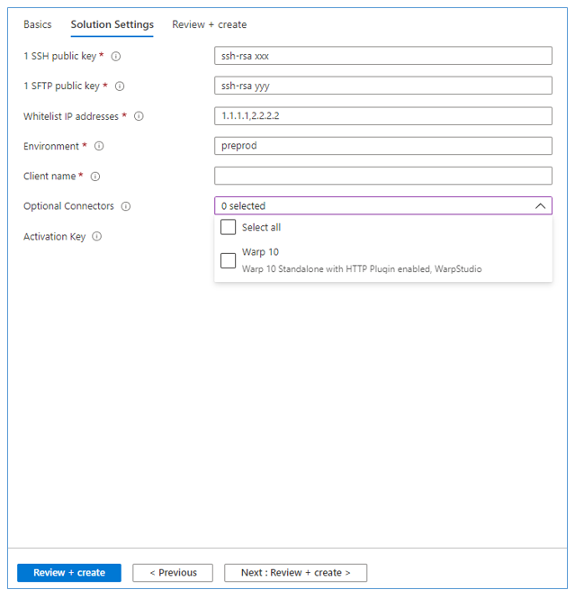

## II. Steps

### 1. One SSH Public key

This step creates a new SSH key pair.

Purpose: After deployment successfully finished, you can use this private key to SSH into VMs.

Note: If you want to use an already exist key pair, you can skip this step. 

Open CMD on windows (Window button + R → “cmd”):

This document using OpenSSH to generate key pairs (you can use any tool as you like)

①. Run command: ssh-keygen

②. Enter file name

③. Enter your passphrase or skip it by Enter

Key pair will be created in your folder

Open ssh-key.pub file

### 2. SFTP public key

This step creates a new SSH key pair.

Purpose: After deployment successfully finished, you can use the private key to access into SFTP module.

Note: If you want to use an already exist key pair, you can skip this step.

Open CMD on windows:

①. Run command: ssh-keygen

②. Enter file name

③. Enter your passphrase or skip it by Enter

Key pair will be created in your folder

Open sftp-key.pub file

### 3. List your Whitelist IP addresses

Only IPs from this Whitelist can access to your resources.

You can check from [www.whatismyip.com](https://www.whatismyip.com/).

If you want to input more than one IP, separated them by comma - not include space, Ex: 11.11.11.11,22.22.22.22,33.33.33.33

### 4. Environment

This is environment name in short for all resources, something like “prod” (for production) or “test” (for testing) or “dev” (for develop), etc...

**Constraints**: Lowercase letters and numbers only, length in range [3-7] letters.

### 5. Client name

This is your company/organization in short.

The client name combines with environment make your resources unique among subscriptions. This field should not include some word that reserved by Microsoft (refer document link: https://docs.microsoft.com/en-us/azure/azure-resource-manager/templates/error-reserved-resource-name) (ex: ~~login|microsoft|windows|xbox~~,..etc)

**Constraints**: Lowercase letters and numbers only, length in range [3-10] letters.

### 6. Optional Connectors

You can decide to deploy Warp 10 or not.  
In case you decide to include Warp 10: Select Warp 10 in the check box.   
In case you decide to exclude Warp 10: Unselect Warp 10 in the check box.   

### 7. Activation Key

In case you don’t have it before, please leave it blank.  

**Constraints**: Letters and numbers only, length [19] letters.  

---